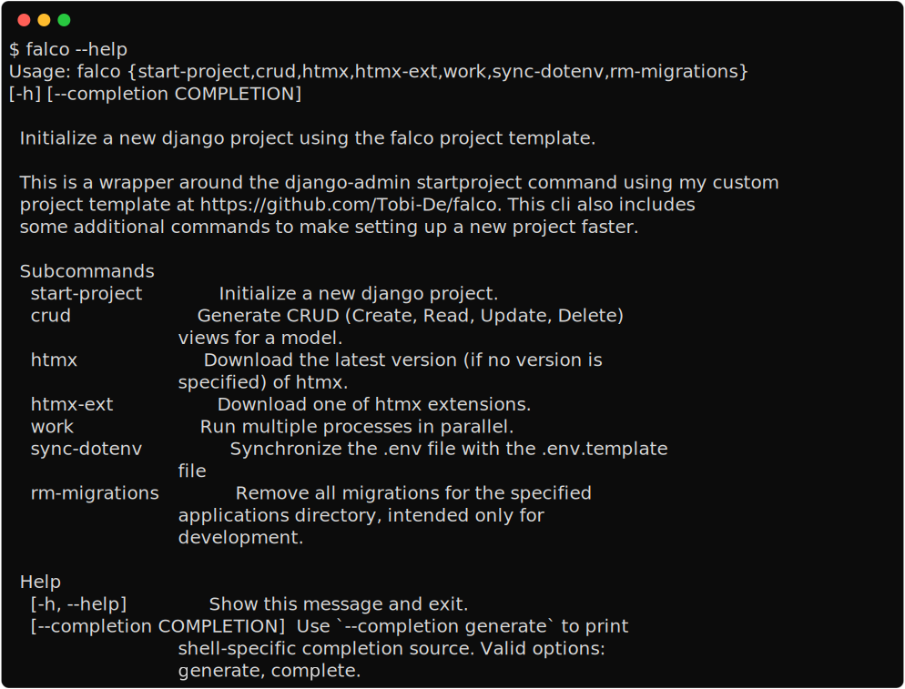

The CLI
=======

The falco CLI is available when you install the package. It is home to some command that I hope you will find useuful through the Lifecycle of your project,
from starting the project through to deployment.

.. hint:: Install the cli
   :class: dropdown

   .. code:: console

      $ pip install falco

The entrypoint for the CLI is the ``falco`` command. It is used to run the commands that are available to you.

.. toctree::
   :hidden:

   start_project
   crud
   htmx
   work
   rm_migrations
   sync_dotenv