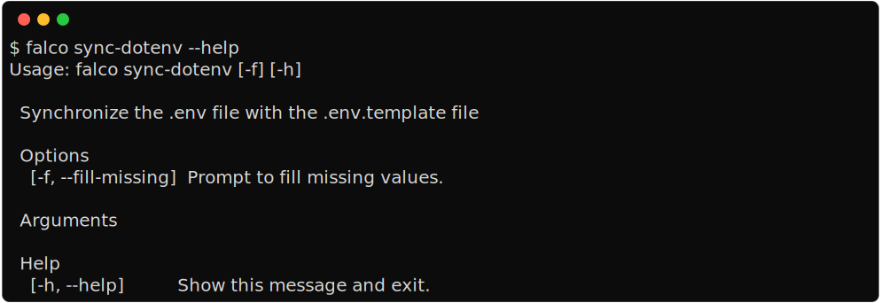

Keep the .env and .env.template in sync
=======================================

Running this will create a new ``.env`` by filling the file with the keys and values from the following options:

1. a ``env.template`` file, used if it exists
2. a ``DEFAULT_VALUES`` dictionary, internal to the ``falco`` package, contains some default for common
   keys, ``DJANGO_DEBUG``, ``DJANGO_SECRET_KEY``, etc.
3. a ``.env`` file, used if it exists

The order defines the priority of the values that are used, which means that the values contained in your
original ``.env`` file are preserved if the file exists.